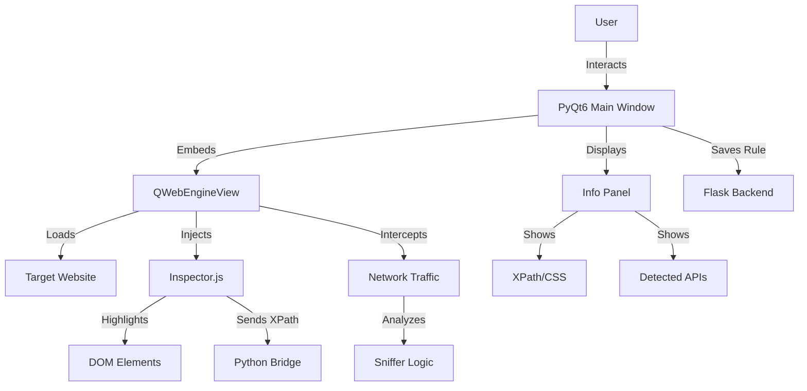

# Visual Browser Sniffer & Collector - Technical Solution

This document outlines the technical design for a Python-based "Visual Browser Container" to enhance the sniffing and collection capabilities of the GovInfoToFileSystem.

## 1. Overview
The goal is to provide a user-friendly, visual interface for:
- Browsing target websites.
- Visually inspecting and selecting DOM elements (Point & Click).
- Automatically generating XPath/CSS selectors.
- Capturing network traffic (API discovery).
- Testing and saving collection rules to the backend.

## 2. Architecture

### 2.1. Core Components
*   **Frontend (GUI)**: Python + PyQt6 (Qt for Python).
*   **Browser Engine**: `QtWebEngine` (Chromium-based).
*   **Interaction Layer**: JavaScript Injection (`QWebEnginePage.runJavaScript`).
*   **Communication Bridge**: `QWebChannel` (Bi-directional Python <-> JS).
*   **Backend Integration**: HTTP Requests to existing Flask API (`/rule/save`, etc.).

### 2.2. Component Diagram

## 3. Detailed Features

### 3.1. Visual Browser Container
- **Address Bar**: Navigate to any URL.
- **Toggle Inspector**: Button to enable/disable "Point & Click" mode.
- **Device Emulation**: (Optional) Switch User-Agent for Mobile/Desktop.

### 3.2. DOM Inspection (The "Sniffer")
- **Hover**: As the mouse moves over elements, inject a semi-transparent overlay or border (`outline: 2px solid red`).
- **Click**: When an element is clicked:
    - Prevent default navigation (if inspector is active).
    - Calculate **XPath** (absolute and relative/smart).
    - Calculate **CSS Selector**.
    - Extract sample text/attributes.
    - Send data to Python via `QWebChannel`.

### 3.3. Network Sniffing
- Subclass `QWebEngineUrlRequestInterceptor` or listen to `profile.downloadRequested`.
- Monitor `XHR` and `Fetch` requests.
- Identify JSON responses.
- If a JSON response contains list-like data, suggest it as an API Source.

### 3.4. Auto-Collection Execution (Backend)
- The existing `crawler_manager.py` and `deep_crawler.py` will be updated to support the rules generated by this tool.
- **Hybrid Strategy**:
    - If `rule_type` is 'api': Use `requests` to fetch JSON.
    - If `rule_type` is 'dom': Use `requests` + `lxml` (Fast) or `Playwright` (if dynamic rendering is needed).

## 4. Implementation Steps

### Phase 1: Prototype (Current Task)
1.  **Setup PyQt6 Environment**: Create `sniffer_tool` directory.
2.  **Browser Window**: Implement `QWebEngineView` with basic navigation.
3.  **Inspector JS**: Develop the JS logic to highlight and calculate XPath.
4.  **Python-JS Bridge**: Receive selection data in Python and print it.
5.  **UI Side Panel**: Display the selected XPath/Content.

### Phase 2: Integration
1.  **Save to DB**: Add "Save Rule" button to post data to the Flask API.
2.  **Network Monitor**: Capture and display background API requests.

## 5. User Workflow
1.  User runs `python sniffer_tool/main.py`.
2.  Enters URL (e.g., `http://example.com/news`).
3.  Clicks "Start Sniffing".
4.  Hovers over the title of a news item -> Element highlights.
5.  Clicks the title.
6.  Side panel shows: `//div[@class="news-list"]/li/a`.
7.  User confirms "Title XPath".
8.  User repeats for "Date" and "Content".
9.  User clicks "Save Rule".
10. Backend stores the rule for the crawler.

